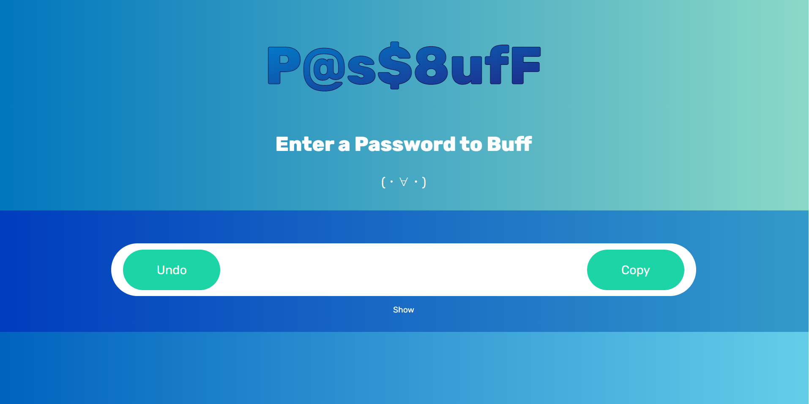

# PassBuff
### [Live Demo](https://pass-buff.web.app)

[](https://pass-buff.web.app)

## About
PassBuff (Password Buffer) is an application which strengthens common or weak passwords by suggesting "buffs" as well as hints for improvement. The strength of the password, ranging from 1 to 7, is gauged using the [zxcvbn](https://github.com/dwolfhub/zxcvbn-python) library in addition to a natural language processing model based off of [Kaggle's Password Strength Classifier Dataset](https://www.kaggle.com/datasets/bhavikbb/password-strength-classifier-dataset).

**Buffs**
- Word Drop
- Number Punch
- GROW
- @Leaf
- Invisibility Cloak
- Earthquake
- B33p-B00p
- Shadow Clone
- Cupid's Arrow
- Emote

3 buffs are randomly selected, can be rerolled, and are applied by user selection.

### Built With
The frontend was built using [Vue.js](https://vuejs.org/) and the backend server is handled using [Flask](https://flask.palletsprojects.com/en/2.1.x/), with scripts for machine learning and buff generation written in **python** and **Jupyter Notebooks**. The hint popup was created using [SweetAlert2](https://sweetalert2.github.io/)

Hosted on [Firebase](https://firebase.google.com/) for the frontend and [Heroku](https://www.heroku.com/) for the API and the backend

## Installation
1. Ensure npm is installed <br>
``` npm install npm@latest -g ```
2. Traverse to the correct directory and install all dependencies <br>
```cd passbuff``` <br>
```npm i ```
3. Run ```python model.py``` to create the models in the ```server/backend``` folder (may take a while) <br>
4. Host the frontend at [http://localhost:8080/](http://localhost:8080/) from the ```passbuff``` folder <br>
``` npm run serve ```
5. Host the backend at [http://localhost:5000/](http://localhost:5000/) from the ```server``` folder <br>
``` python api.py ```
